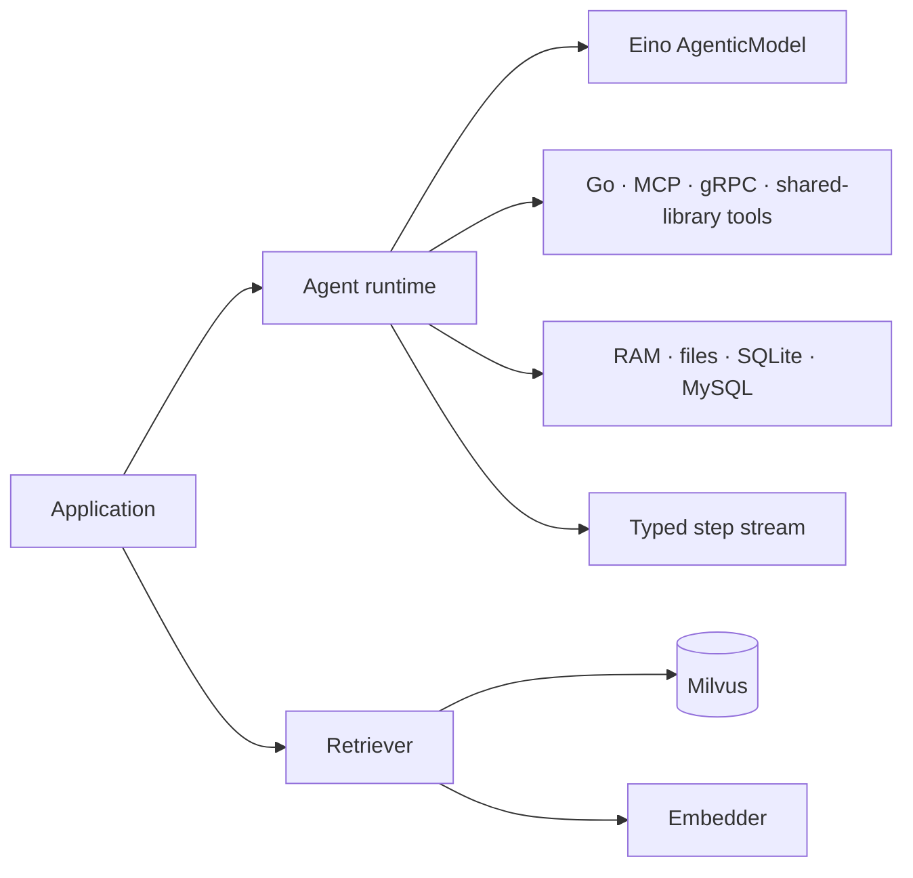

<div align="center">
  <h1>goat 🐐</h1>
  <p><strong>A modular Go toolkit for building tool-using AI agents and retrieval pipelines.</strong></p>
  <p>
    <a href="https://go.dev/"></a>
    <a href="https://github.com/torrischen/goat/actions/workflows/ci.yml"></a>
    <a href="https://pkg.go.dev/github.com/torrischen/goat/agent/react"></a>
    <a href="LICENSE"></a>
  </p>
  <p>
    <a href="#features">Features</a> ·
    <a href="#quick-start">Quick start</a> ·
    <a href="#packages">Packages</a> ·
    <a href="#documentation">Documentation</a>
  </p>
</div>

`goat` combines an asynchronous agent runtime, persistent conversation context, extensible tools, Milvus retrieval, multi-provider embeddings, structured prompt building, and typed streams in one Go module. The agent layer is built on [CloudWeGo Eino](https://github.com/cloudwego/eino) and accepts any `model.AgenticModel` implementation.

## Features

- **Native tool calling** — execute one or more model-selected tools in an agent loop.
- **Model agnostic** — use Eino adapters for OpenAI, Azure OpenAI, Claude, Gemini, or another compatible provider.
- **Context management** — choose RAM, local files, SQLite, or MySQL and resume a conversation by `ContextUID`.
- **Live steering** — queue one or more user messages while an agent runs and apply them at the next protocol-safe turn boundary.
- **Context compression** — compact long tool histories with precise, aggressive, or no-model discard strategies.
- **Extensible tools** — register Go functions, MCP tools, Go shared libraries, or gRPC plugins.
- **Planning and skills** — expose built-in planning tools and load skills on demand from a `skills/` directory.
- **Streaming execution** — consume typed tool and final-answer steps, token usage, callbacks, and final-answer webhooks.
- **Multimodal input and output** — pass image URLs, Base64 data, or binary images through supported models and tools.
- **Milvus retrieval** — use dense vector, BM25, or hybrid retrieval with filters, partitions, and JSON fields.
- **Reusable primitives** — multi-provider embeddings, a fluent prompt builder, and concurrent generic streams.

## Packages

| Package | Purpose |
| --- | --- |
| [`agent/react`](agent/react) | Asynchronous native function-calling agent runtime. |
| [`agent/common`](agent/common) | Agent, tool, step, callback, and multimodal contracts. |
| [`agent/contextmgr`](agent/contextmgr) | Context manager interface plus RAM, file, SQLite, and MySQL backends. |
| [`agent/tools`](agent/tools) | Planning, skills, terminal, and shell tools. |
| [`agent/toolplugin`](agent/toolplugin) | Go shared-library and gRPC tool plugins. |
| [`embedder`](embedder) | Embedding clients for OpenAI-compatible APIs, Gemini, Cohere, Voyage AI, and Ollama. |
| [`retriever/milvus`](retriever/milvus) | Vector, BM25, and hybrid Milvus retrievers. |
| [`prompt`](prompt) | Fluent Markdown prompt builder. |
| [`streaming`](streaming) | Concurrent, type-safe generic streams. |



## Requirements

- Go **1.25.8** or newer.
- Credentials for the model or embedding provider you choose.
- Milvus **2.6** only when using the retriever packages.
- CGO and a C compiler when using the SQLite context manager.

## Installation

Install only the packages your application needs:

```bash
go get github.com/torrischen/goat/agent/react
go get github.com/torrischen/goat/agent/contextmgr/ram
go get github.com/cloudwego/eino-ext/components/model/agenticopenai
```

Optional components can be added independently:

```bash
go get github.com/torrischen/goat/retriever/milvus/hybrid
go get github.com/torrischen/goat/prompt
go get github.com/torrischen/goat/streaming
```

## Quick start

Set an API key:

```bash
export OPENAI_API_KEY="your-api-key"
```

Create and run an agent:

```go
package main

import (
	"context"
	"errors"
	"fmt"
	"log"
	"os"

	"github.com/cloudwego/eino-ext/components/model/agenticopenai"
	"github.com/torrischen/goat/agent/common"
	"github.com/torrischen/goat/agent/contextmgr/ram"
	"github.com/torrischen/goat/agent/react"
	"github.com/torrischen/goat/streaming"
)

func main() {
	ctx := context.Background()

	llm, err := agenticopenai.NewResponsesModel(ctx, &agenticopenai.ResponsesConfig{
		APIKey: os.Getenv("OPENAI_API_KEY"),
		Model:  "gpt-5.2",
	})
	if err != nil {
		log.Fatal(err)
	}

	// 128 means an approximately 128K-token model context window.
	agent := react.NewAgent(llm, 128, ram.NewRAMContextManager())

	contextUID, steps, err := agent.Do(ctx, &common.AgentDoArgs{
		UserInput: common.AgentUserInput{
			Text: "Explain why typed streams are useful in Go in three bullets.",
		},
		MaxStep: 8,
	})
	if err != nil {
		log.Fatal(err)
	}

	for {
		step, err := steps.ReadWithContext(ctx)
		switch {
		case errors.Is(err, streaming.ErrStreamClosed):
			fmt.Printf("\nConversation: %s\n", contextUID)
			return
		case err != nil:
			log.Fatal(err)
		case step.IsFinalAnswer:
			fmt.Println(step.Observation)
		}
	}
}
```

`Agent.Do` stores the user message, starts the agent loop in the background, and immediately returns a `ContextUID` plus a stream for that run. Consume the stream until `streaming.ErrStreamClosed` before starting another turn with the same `ContextUID`.

While the run is active, queue additional user messages with `Steer`:

```go
err = agent.Steer(ctx, &common.AgentSteerArgs{
	ContextUID: contextUID,
	UserInputs: []common.AgentUserInput{
		{Text: "Do not deploy yet."},
		{Text: "Run all tests first."},
	},
})
```

The messages are queued in the context manager and applied after the next complete tool turn. A final answer always wins and discards messages that are still pending at that boundary. After final commit, `Steer` returns `contextmgr.ErrConversationFinalized`; the next `Do` user input reopens steering.

### Add a custom tool

Tools use JSON Schema parameters and return text or multimodal results:

```go
weatherTool := common.NewDefaultTool(
	"get_weather",
	"Return the current weather for a city.",
	common.NewToolParameters(common.ToolProperty{
		Name:        "city",
		Type:        "string",
		Required:    true,
		Description: "City name, for example Tokyo.",
	}),
	func(_ *common.AgentContext, input map[string]any) common.ToolResult {
		city, ok := input["city"].(string)
		if !ok || city == "" {
			return common.NewDefaultToolResult("city must be a non-empty string")
		}
		return common.NewDefaultToolResult(
			fmt.Sprintf("The weather in %s is clear and 22°C.", city),
		)
	},
)

agent.AddTool(ctx, weatherTool)
```

Use `ToolProperty.Items` and `ToolProperty.Properties` for array and nested-object schemas. Tool names are normalized for model compatibility, and duplicate names receive a numeric suffix.

### Enable planning, compression, and parallel tools

```go
_, planningSteps, err := agent.Do(ctx, &common.AgentDoArgs{
	UserInput:      common.AgentUserInput{Text: "Analyze this project and propose a refactor."},
	MaxStep:        12,
	EnablePlanning: true,
	Compress:       true,
	CompressionOptions: common.CompressionOptions{
		Strategy:       common.CompressionStrategyPrecise,
		RecentMessages: 12,
	},
	ToolExecutionOptions: &common.ToolExecutionOptions{
		EnableParallel: true,
		MaxConcurrency: 4,
	},
})
```

Consume `planningSteps` in the same way as the quick-start stream; the run is complete when the stream closes.

## Conversation context management

Pass a `contextmgr.ContextManager` implementation to `react.NewAgent`. Passing `nil` uses a `file.FileContextManager` rooted at `data/conversations`.

| Backend | Constructor | Best suited for |
| --- | --- | --- |
| RAM | `ram.NewRAMContextManager()` | Tests and short-lived processes. |
| Files | `file.NewFileContextManager("")` | Simple local atomic-file persistence. |
| SQLite | `sqlite.NewSQLiteContextManager("")` | Durable single-node applications. |
| MySQL | `mysql.NewMysqlContextManager(...)` | Shared, multi-process deployments. |

Continue a completed conversation by passing the returned ID into the next run:

```go
_, nextSteps, err := agent.Do(ctx, &common.AgentDoArgs{
	ContextUID: contextUID,
	UserInput: common.AgentUserInput{Text: "Summarize our conversation."},
})
```

## Retrieval

The Milvus integration exposes three retrieval strategies behind similar collection, partition, write, search, upsert, and delete APIs:

| Retriever | Search | Embedder required |
| --- | --- | --- |
| [`vector`](retriever/milvus/vector) | Dense semantic similarity | Yes |
| [`bm25`](retriever/milvus/bm25) | Keyword/full-text relevance | No |
| [`hybrid`](retriever/milvus/hybrid) | Vector + BM25 with RRF or weighted reranking | Yes |

Retrievers support scalar and JSON-path filters, custom JSON fields and indexes, pagination, and partition management. See the [Retriever guide](retriever/README.md) for a complete hybrid-search example and operational notes.

## Model providers

`react.NewAgent` accepts Eino's `model.AgenticModel` interface. Provider authentication, endpoints, and provider-specific options stay in the selected Eino adapter:

- `agenticopenai` for OpenAI Responses and Azure OpenAI.
- `agenticclaude` for Claude.
- `agenticgemini` for Gemini and Vertex AI.

See the [Agent SDK guide](agent/README.md) for provider setup, MCP registration, skills, multimodal messages, callbacks, webhooks, and plugin loading.

## Documentation

- [Agent SDK guide](agent/README.md)
- [Tool array and nested parameter schemas](agent/common/ARRAY_PARAMETERS.md)
- [Tool plugin cookbook](agent/toolplugin/README.md)
- [Retriever SDK guide](retriever/README.md)
- [Prompt builder guide](prompt/README.md)
- [Streaming SDK guide](streaming/README.md)
- [Integration examples](example)
  - [Complex OpenAI agent (planning, parallel tools, callbacks, and streaming)](example/complex_agent)

## Security

Model-generated tool arguments are untrusted input. Validate parameters, enforce authorization and idempotency for side effects, apply timeouts, and run privileged tools in a sandbox. In particular, `agent/tools.Terminal` and `agent/tools.ShellCommand` execute commands with the permissions of the current process and should only be registered in controlled environments.

Never commit provider credentials or include them directly in tool output, logs, or persisted conversation context.

## Development

```bash
git clone https://github.com/torrischen/goat.git
cd goat
go mod download
go test ./...
```

When changing the gRPC plugin protocol, regenerate its Go bindings with:

```bash
make proto
```

Issues and pull requests are welcome. Please format Go changes with `gofmt` and include tests for new behavior. See the [contribution guide](CONTRIBUTING.md), [security policy](SECURITY.md), [code of conduct](CODE_OF_CONDUCT.md), and [changelog](CHANGELOG.md) for project policies.

## License

`goat` is distributed under the [BSD 3-Clause License](LICENSE).
